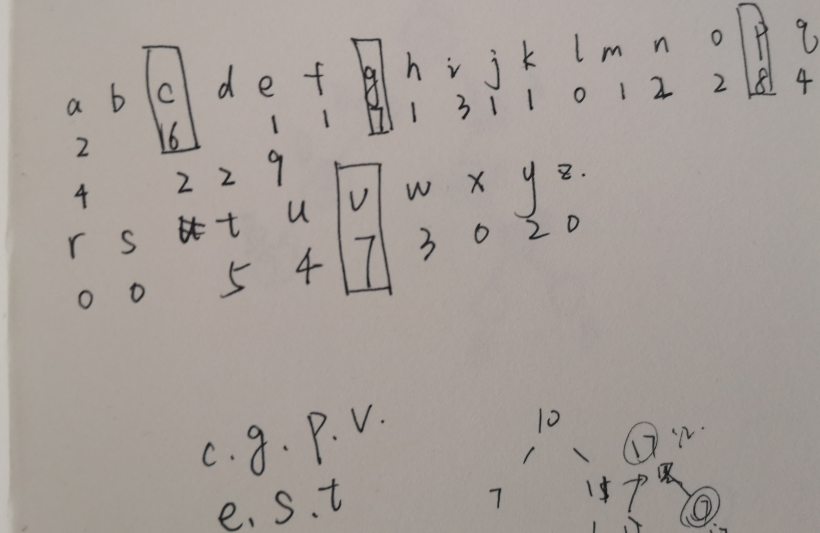

### 信息安全原理hw1 

3180104933 王祚滨

------

密码1：

- 解密过程：根据对25种可能出现的凯撒密码进行遍历，然后人眼提取识别明文

``` c++
#include <string>
#include <iostream>
using namespace std;

int main()
{
    string r = "FBUQIUUDSHOFJOEKHDQCUMYJXJXUIQCUAUOQDTKFBEQTJEBUQHDYDWYDPZK";
    for (int j = 0; j < 26; j++)
    {
        for (int i = 0; i < r.length(); i++)
        {
            r[i] = (r[i]-'A'+1)%26 +'A';
        }
        cout << r << endl;
    }
    //row 9
    //PLEASEENCRYPTYOURNAMEWITHTHESAMEKEYANDUPLOADTOLEARNINGINZJU
    //please encrypty your name with the same key and upload to learning in zju.

```

​		得到结果为  please encrypty your name with the same key and upload to learning in zju.

``` c++
    //my name is wangzuobin
    string name = "WANGZUOBIN";
    for (int i = 0; i < name.length(); i++)
        {
            name[i] = (name[i]-'A'+16)%26 +'A';
        }
        cout << name << endl;
    //result = MQDWPKERYD
}
```

​	输出展示：


- key:此次凯撒密码通过将明文向右顺移16位（向左顺移10位）构成

- 将名字加密后的结果为：MQDWPKERYD


密码2：

- 解密过程：

  1. 寻找长度大于3的公共子序列，并将其间隔位置输出

     ```c++
     #include <iostream>
     #include <string>
     #include <vector>
     using namespace std;
     
     string FindStr(const string &str)
     {
         string temp, MaxStr;
         int MaxLen = 0;
         for (int i = 0; i < str.length(); ++i)
         {
             for (int j = str.length() - i; j != 0; --j)
             {
                 temp = str.substr(i, j);
                 int front = str.find(temp);
                 int behind = str.rfind(temp);
                 int templen = temp.length();
                 if (front != behind && templen > MaxLen)
                 {
                     MaxStr = temp;
                     MaxLen = templen;
                 }
             }
         }
         return MaxStr;
     }
     
     int main()
     {
         string r = "ktbueluegvitnthuexmonveggmrcgxptlyhhjaogchoemqchpdnetxupbqntietiabpsmaoncnwvoutiugtagmmqsxtvxaoniiogtagmbpsmtuvvihpstpdvcrxhokvhxotawswquunewcgxptlcrxtevtubvewcnwwsxfsnptswtagakvoyyak";
         string t;
         t = r;
         //part 1 : find length
         for (string tmp = FindStr(t); tmp.length() > 2;)
         {
             cout << tmp;
             vector<int> m;
             string l = r;
             for (int i = l.find(tmp); i != -1;)
             {
                 m.push_back(i + tmp.length());
                 l.erase(0, i + tmp.length());
                 i = l.find(tmp);
             }
             vector<int>::iterator ite = m.begin();
             for (; ite != m.end(); ite++)
             {
                 cout << *ite << " ";
             }
             cout << endl;
             int pos = 0;
             while ((pos = t.find(tmp)) != -1)
             {
                 t.erase(pos, tmp.length());
             }
             tmp = FindStr(t);
         }
         //key_length:3
     }
     ```

     输出结果为：

     

     其中可以发现，这些字符串都只出现过两次，于是我先尝试其最大公因数3为密钥长度

  2. 然后，对原始字符串进行分组，并进行频率分析

     ``` c++
      //part 2:compute frequency
         string ll = "";
     
         for (int j = 0; j < 3; j++)
         {
             string gg = "";
             for (int i = j; i < r.length(); i += 3)
             {
                 gg += r[i];
             }
             cout << gg << endl;
             int cnt[256] = {};
             for (int i = 0; i < gg.size(); i++)
                 cnt[(int)gg[i]]++;
             int max = 0;
     
             for (int i = 0; i < 256; i++) //输出字符出现次数
             {
                 if (cnt[i] > cnt[max])
                     max = i;
                 if (cnt[i] != 0)
                     cout << (char)i << ':' << cnt[i] << endl;
             }
             cout << "max" << (char)max << ':' << cnt[max] << endl;
     
             cout << "....................................." << endl;
         }
     ```

     得到结果为：

     

     

     

  3. 我进行了对密钥的第一次尝试，选取'ptx'对应字母e来进行破解，得到的结果却不尽人意，于是我将出现过的次数全部列举，并得到了

     

  4. 于是我决定对这些可能是密钥的序列进行穷举，

     ``` c++
      //part 3
         string key[12] = { "cex", "csx", "ctx", "gex", "gsx", "gtx", "pex", "psx", "ptx", "vex", "vsx", "vtx" };
     
         for (int j = 0; j < 12; j++)
         {
             string res = r;
             for (int i = 0; i < res.length(); i++)
             {
                 res[i] = (res[i] - (key[j][i % 3] - 'e') - 'a' + 26) % 26 + 'a';
             }
             cout << res << endl;
         }
        // It is essential to seek out enemy agents who have come to conduct espionage against you and to bribe them to serve you give them instruction sand care for them thus doubled agents are recruited and used suntzu the art of war
     ```

     
     
     最后成功破解密码

- 密钥：‘cat'


- 明文： It is essential to seek out enemy agents who have come to conduct espionage against you and to bribe them to serve you give them instruction sand care for them thus doubled agents are recruited and used suntzu the art of war


密码3：

- 破解过程：

  这个密码很有趣，最开始我想到的是之前见到过的一个破解方式，用每个以空格分隔的字符串长度来编码一个字母，尝试后发现不可行，于是重新审题，发现有一个引号在其中，提示我们这是一句话，再看发现MAL这个词频繁出现，将其破译为’the'，并以此入手

  ``` c++
  
      string r = "MAL TIRRUEZF CR MAL RKZYIOL EX MAL OIY UAE RICF MAL ACWALRM DYEUPLFWL CR ME DYEU MAIM UL IZL RKZZEKYFLF GH OHRMLZH"
               // the password is the surname of the man who said the highest knowledge is to know that we are surrounded by mystery
  //阿尔伯特·史威哲（Albert Schweitzer）
      A,B,C,D,E,F,G,H,I,J,K,L,M,N,O,P,Q,R,S,T,U,V,W,X,Y,Z
      H, ,I,k,O,d,b,y,A, ,u,E,T, ,m,l, ,S, ,p,w, ,g,F,n,R,
  
  ```

- 密钥：一张单表，如上面模块最后两行展示

- 明文：the password is the surname of the man who said the highest knowledge is to know that we are surrounded by mystery，经过搜索，结果为：阿尔伯特·史威哲（Albert Schweitzer）